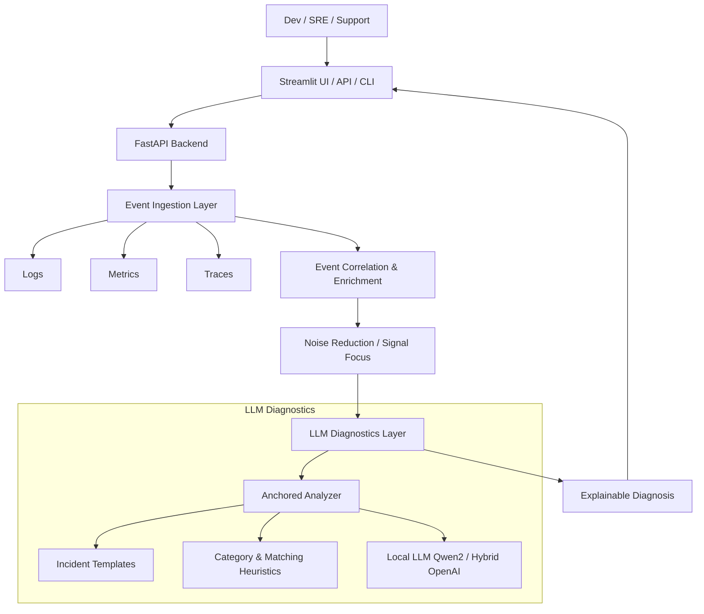
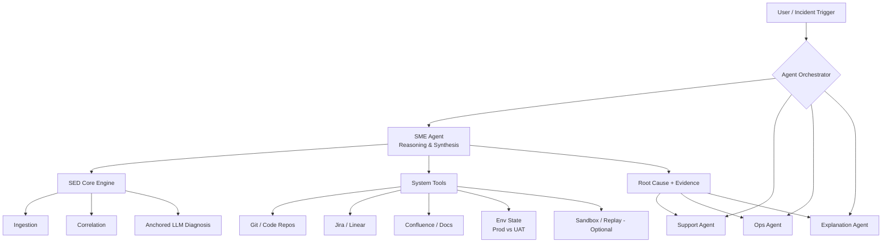

# Smart Enterprise Diagnostics (SED)

## 📖 Project Overview

**System Diagnostics Copilot** is an experimental **Enterprise Event Intelligence platform** built to explore modern AI-Native development patterns. It leverages Generative AI to ingest, correlate, and diagnose system events in real-time, focusing on **explainable automation**.

> **Note**: This is a personal project to experiment with Agentic Workflows, LLM orchestration, and modern AI coding tools like **Google Antigravity**, **Cursor**, and **Codex**. It serves as a sandbox for learning new tech stacks and is not related to any professional employment.

### Vision
> **Data → Ingestion → Correlation → LLM Diagnosis → Automation → Continuous Learning**

### 🚀 Architecture & Differentiation
The industry is shifting from dashboard-heavy platforms to AI-driven interpretation and automated diagnostics. SED targets the quadrant combining **high intelligence with simple deployment**—an underserved segment compared to heavy enterprise incumbents.

**Key Differentiators:**
- **LLM‐first architecture**: Built for AI from day one (not retrofitted).
- **Explainable & Auditable**: Diagnostics are "glass-box" and auditable (unlike black-box ML).
- **Lightweight On-prem Option**: Run entirely locally (e.g., Qwen2) for data privacy and speed.
- **Seamless Integrations**: Native support for ServiceNow, Slack, and standard log pipelines.

### ⚠️ The Problem
Enterprises face **alert overload**, fragmented tools, and long Mean Time To Resolution (MTTR). This project prototypes a solution that combines high intelligence with simple deployment to reduce noise and automate root cause analysis.

## ⚡ Core Capabilities

- **Cross‐domain Event Ingestion**: Unified intake for logs, metrics, and traces.
- **Event Correlation & Enrichment**: Noise reduction engine to focus on what matters.
- **Predictive Analytics**: Anticipate issues before they cause outages.
- **Automation Workflows**: Trigger remediations or actionable alerts automatically.
- **Explainable Diagnostics**: Template-anchored reasoning (see `src/llm/anchored_analyzer.py`) prevents hallucinations.
- **On‐prem / Hybrid Deployment**: Flexible hosting models to suit security needs.

---

## 🧠 SED Architecture — Current State + Next Step

### 🟢 Current Architecture (what exists today)



**What this captures accurately:**
- **Cross-domain ingestion** (logs / metrics / traces)
- **Correlation before LLMs** (critical, and rare)
- **Template-anchored reasoning** to de-risk hallucinations
- **Local-first LLM** with hybrid fallback
- **Human-facing explanation layer**

This already puts SED ahead of many “AI Ops” demos.

### 🔵 Agentic Orchestration Layer (Alpha)

This sits on top of your existing engine, orchestrating diagnostics through autonomous agents.



> **Status: Implemented (Alpha)**
> The Agentic Orchestration Layer is now live! In this layer, a central **SME agent** coordinates diagnostics, environment context, and system tools to perform first-pass root cause analysis. This allows downstream agents (support, ops, customer-facing) to act on a shared, evidence-backed explanation rather than raw alerts or logs.
>
> **Available Agents:**
> - **Agent Orchestrator**: The entry point that routes user intent to the right specialist.
> - **SME Agent**: The "Lead Engineer" that plans diagnostics and synthesizes findings.
> - **Log Analysis Agent**: A specialist tool that fetches and interprets logs using local LLMs.
>
> See [AGENTS.md](AGENTS.md) for architecture details and usage.

---

## 🛠️ Technical Architecture & Developer Guide

This repository contains the reference implementation of the SED Engine. It ships with a local Qwen2 workflow, hybrid OpenAI fallback, a FastAPI backend, and Streamlit dashboards.

## 🏗️ Project Layout

```
ai-copilot/
├── src/
│   ├── api/                # FastAPI service (REST + health checks)
│   ├── data/               # Log fetchers / integrations
│   ├── llm/
│   │   ├── anchored_analyzer.py   # Template-anchored incident classifier
│   │   ├── local_analyzer.py      # Local + hybrid analyzers
│   │   ├── incident_templates.py  # Predefined incident registry
│   │   └── copilot.py             # Factory + service wiring
│   └── ui/                # Streamlit dashboards
├── tests/                 # Pytest suites (dashboard, integrations, etc.)
├── example_anchored_monitoring.py # End-to-end anchored demo
├── test_anchored_analyzer.py      # Focused template regression suite
├── LOCAL_LLM_SETUP.md             # Detailed Ollama guide
├── DE_RISKING_HALLUCINATIONS.md   # Deep dive into template anchoring
├── DE_RISKING_ARCHITECTURE.md     # System diagrams + rationale
└── README.md
```

## 🚀 Getting Started

### Prerequisites

- Python 3.11+
- [Ollama](https://ollama.com/) for local inference (recommended)
- Optional: OpenAI API key for hybrid/cloud mode

### 1. Clone & Install

```bash
cd ai-copilot
python -m venv venv
source venv/bin/activate        # Windows: venv\Scripts\activate
pip install -r requirements.txt
pip install -e ".[dev]"        # Optional: formatter, linters, pytest plugins
```

### 2. Run Local Demo

```bash
brew install ollama            # macOS via Homebrew
brew services start ollama
ollama pull qwen2:1.5b         # Lightweight model used across examples
```

## 📚 Usage Recipes

| Goal | Command |
|------|---------|
| Quick local demo of log analysis | `python src/llm/hello_llm_local.py` |
| Run anchored monitoring example | `python example_anchored_monitoring.py` |
| One-off log pipeline run | `python scripts/log_pipeline_demo.py --prompt-only` |
| Spin up FastAPI service | `uvicorn src.api.main:app --reload` |
| Launch Streamlit dashboard | `streamlit run src/ui/dashboard.py` |
| Hybrid analyzer via factory | See `create_analyzer` in `src/llm/copilot.py` |

## ✅ Testing & Quality

| Scope | Command |
|-------|---------|
| Entire pytest suite | `pytest` |
| Anchored template regression | `python test_anchored_analyzer.py` |
| Dashboard smoke / guide | `python test_dashboard.py --guide` |
| Streamlit integration tests | `pytest tests/test_dashboard.py -k integration` |
| Prometheus integration checks | `pytest tests/test_prometheus.py` |

Additional testing scenarios (mock server, UI automation, etc.) are documented in [`TESTING.md`](TESTING.md).

## 📖 Further Documentation

- [`LOCAL_LLM_SETUP.md`](LOCAL_LLM_SETUP.md) – Ollama installation, hybrid mode configuration, and model catalog.
- [`DE_RISKING_HALLUCINATIONS.md`](DE_RISKING_HALLUCINATIONS.md) – why and how the template anchoring works, including category matrices and matching heuristics.
- [`DE_RISKING_ARCHITECTURE.md`](DE_RISKING_ARCHITECTURE.md) – structural diagrams and benefit analysis.
- [`SECURITY.md`](SECURITY.md) & `security-check.sh` – hardening checklist before deploying new endpoints.
- [`LINEAR_INTEGRATION.md`](LINEAR_INTEGRATION.md) – optional Linear issue creation from analysis results.
- [`docs/log_ingestion.md`](docs/log_ingestion.md) – log pipeline configuration, parsers, and roadmap.

## 🤝 Contributing

1. Fork the repository and create a feature branch.
2. Ensure `black .`, `flake8`, and `pytest` succeed locally.
3. Update or add tests when behaviour changes.
4. Document configuration or template additions in the relevant doc.
5. Submit a PR describing the change, test results, and any follow-up work.

## 📄 License

MIT License – see [`LICENSE`](LICENSE) for details.

---

## ⚖️ Project Governance & Legal Disclaimer

This repository is a **personal project** created for the sole purpose of educational exploration into AI-Native development patterns, Agentic Workflows, and LLM Orchestration.

* **Independence:** This project is developed entirely in my personal capacity, on my own time, and using my own personal equipment. It is not affiliated with, sponsored by, or endorsed by any of my past or present employers.
* **Intellectual Property:** All code, architectural designs, and logic within this repository have been authored from scratch or generated through interactions with public Generative AI tools (e.g., Cursor, Codex, Google Antigravity). No proprietary code, internal libraries, private data, or trade secrets from any professional employment were used in the creation of this project.
* **Generic Domain:** While informed by two decades of experience in high-availability systems, the diagnostic patterns explored here are generic in nature and designed to apply to any distributed enterprise architecture.
* **No Liability:** This software is provided "as is," without warranty of any kind. It is a sandbox for learning and should be treated as experimental.

**License:** This project is licensed under the [MIT License](https://opensource.org/licenses/MIT) (or choose Apache 2.0) — see the LICENSE file for details.
