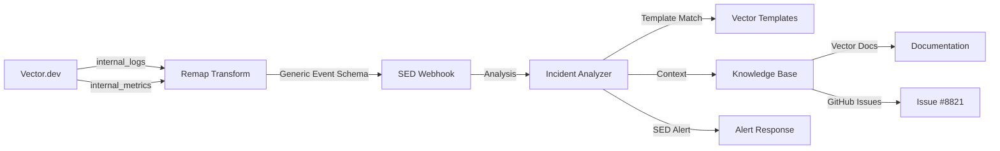

# Vector.dev Integration with SED

## Overview
This guide demonstrates how to integrate Vector.dev with SED (Smart Enterprise Diagnostics) to monitor Vector's health, diagnose pipeline bottlenecks, and troubleshoot sink failures.

## Architecture



## Prerequisites

1. **SED Running**: Ensure SED API is running on `http://localhost:8000`
2. **Vector Installed**: Vector 0.35.0 or later
3. **Python 3.11+**: For SED

## Quick Start

### 1. Start SED

```bash
cd ai-copilot-public
source venv/bin/activate
uvicorn src.api.main:app --reload --port 8000
```

### 2. Configure Vector

Copy the provided Vector configuration:

```bash
cp src/config/vector.toml /etc/vector/vector.toml
# Or for local testing:
cp src/config/vector.toml ./vector-test.toml
```

**Important**: Update the SED webhook URL in `vector.toml` if SED is not on localhost:

```toml
[sinks.sed_webhook]
uri = "http://your-sed-host:8000/api/v1/events/webhook"
```

### 3. Start Vector

```bash
vector --config vector-test.toml
```

### 4. Verify Integration

Send a test event:

```bash
curl -X POST http://localhost:8000/api/v1/events/webhook \
  -H "Content-Type: application/json" \
  -d '{
    "source_system": "vector",
    "event_type": "error",
    "component": "test_sink",
    "message": "Sink failed with HTTP 403 Forbidden",
    "severity": "high",
    "metadata": {
      "error_code": "403",
      "sink_type": "http"
    }
  }'
```

Expected response:

```json
{
  "event_id": "550e8400-e29b-41d4-a716-446655440000",
  "status": "processed",
  "category": "VECTOR_CREDENTIAL_ROTATION",
  "severity": "high",
  "summary": "🚨 Vector sink 'test_sink' failed with 403",
  "next_step": "Rotate credentials, update Vector config, restart affected components...",
  "confidence": 0.92,
  "processed_at": "2026-02-08T21:15:00Z"
}
```

## Configuration Details

### Vector Configuration Breakdown

#### 1. Internal Logs Source
```toml
[sources.internal_logs]
type = "internal_logs"
```
Captures Vector's own log messages (errors, warnings, info).

#### 2. Internal Metrics Source
```toml
[sources.internal_metrics]
type = "internal_metrics"
```
Captures Vector's internal metrics (component errors, buffer usage, etc.).

#### 3. Log Transform
```toml
[transforms.sed_format_logs]
type = "remap"
inputs = ["internal_logs"]
source = '''
  .source_system = "vector"
  .event_type = if .level == "ERROR" { "error" } else if .level == "WARN" { "warning" } else { "info" }
  .component = .metadata.component_name ?? "unknown"
  .message = .message
  .severity = if .level == "ERROR" { "high" } else if .level == "WARN" { "medium" } else { "low" }
  ...
'''
```
Transforms Vector's internal logs into SED's generic event schema.

#### 4. Metrics Transform
```toml
[transforms.sed_format_metrics]
type = "remap"
inputs = ["internal_metrics"]
source = '''
  # Only send metrics that indicate problems
  if .name == "component_errors_total" && .counter.value > 0 {
    ...
  }
'''
```
Converts critical metrics (errors, high buffer usage) into events.

#### 5. SED Webhook Sink
```toml
[sinks.sed_webhook]
type = "http"
inputs = ["sed_format_logs", "sed_format_metrics"]
uri = "http://localhost:8000/api/v1/events/webhook"
encoding.codec = "json"
batch.max_events = 10
batch.timeout_secs = 5
```
Sends formatted events to SED's webhook endpoint.

### SED Alert Schema

SED processes events and returns structured alerts following the schema in `src/config/sed_alert_schema.json`:

```json
{
  "alert_id": "uuid",
  "timestamp": "ISO 8601",
  "source_system": "vector",
  "component": "prod_sink",
  "raw_error": {
    "message": "...",
    "level": "ERROR",
    "metadata": {...}
  },
  "analysis": {
    "category": "VECTOR_CREDENTIAL_ROTATION",
    "severity": "high",
    "summary": "...",
    "cause": "...",
    "next_step": "...",
    "confidence": 0.92
  },
  "context": {
    "github_issue": {
      "number": 8821,
      "url": "https://github.com/vectordotdev/vector/issues/8821"
    },
    "documentation": {
      "url": "https://vector.dev/docs/..."
    }
  }
}
```

## Vector-Specific Incident Templates

SED includes Vector-specific templates in `src/config/templates/vector.yaml`:

| Category | Severity | Trigger |
|----------|----------|---------|
| `VECTOR_SINK_FAILURE` | High | Sink component errors |
| `VECTOR_SCHEMA_MISMATCH` | Medium | Schema validation failures |
| `VECTOR_COMPONENT_FAILURE` | High | Component health check failures |
| `VECTOR_BUFFER_OVERFLOW` | Critical | Buffer capacity exceeded |
| `VECTOR_CREDENTIAL_ROTATION` | High | 403/401 authentication errors |

## Example Scenarios

### Scenario 1: Sink Credential Rotation

**Vector Error**:
```
ERROR sink{component_name=prod_sink}: HTTP request failed error=403 Forbidden
```

**SED Analysis**:
```json
{
  "category": "VECTOR_CREDENTIAL_ROTATION",
  "severity": "high",
  "summary": "🚨 Vector sink 'prod_sink' failed with 403",
  "cause": "Credentials expired or rotated - known issue in Vector #8821",
  "next_step": "Rotate credentials, update Vector config, restart affected components. See: https://vector.dev/docs/reference/configuration/sinks/http/",
  "context": {
    "github_issue": {
      "number": 8821,
      "url": "https://github.com/vectordotdev/vector/issues/8821",
      "title": "HTTP sink fails after credential rotation"
    }
  }
}
```

### Scenario 2: Schema Mismatch

**Vector Error**:
```
ERROR transform{component_name=json_parser}: Schema validation failed field=timestamp expected=string got=integer
```

**SED Analysis**:
```json
{
  "category": "VECTOR_SCHEMA_MISMATCH",
  "severity": "medium",
  "summary": "🚨 Vector schema mismatch in 'json_parser' - type error",
  "cause": "Schema validation failed due to type mismatch",
  "next_step": "Review schema definition, validate input data format, check Vector transform configuration"
}
```

## Knowledge Base Integration

SED can index Vector documentation and GitHub issues for enhanced context. See `src/config/vector_knowledge_mapping.md` for details.

### Indexing Vector Docs (Future)

```bash
python scripts/index_vector_docs.py \
  --source https://vector.dev/docs/ \
  --collection vector_knowledge
```

### Querying Knowledge Base

When SED detects a Vector error, it automatically queries the knowledge base:

```python
# Automatic retrieval in webhook handler
retrieved_docs = knowledge_base.search(
    query=f"{error_message} {component_type}",
    filters={"source": "vector-docs", "category": component_type},
    top_k=5
)
```

## Extending to Other Systems

This integration pattern is **generic** and can be applied to any system:

### 1. Create System-Specific Templates

Create `src/config/templates/<system>.yaml`:

```yaml
templates:
  - category: PROMETHEUS_SCRAPE_FAILURE
    severity: high
    summary_template: "Prometheus scrape failed for {target}"
    ...
```

### 2. Configure System to Send Events

Configure your system to POST to `/api/v1/events/webhook`:

```json
{
  "source_system": "prometheus",
  "event_type": "error",
  "component": "api_scraper",
  "message": "Scrape failed: connection timeout",
  "severity": "high"
}
```

### 3. Add Knowledge Sources

Update `src/config/<system>_knowledge_mapping.md` with documentation sources.

## Monitoring the Integration

### Check SED Logs

```bash
tail -f logs/sed.log | grep "Webhook event received"
```

### Check Vector Logs

```bash
vector top  # Interactive monitoring
# Or
tail -f /var/log/vector/vector.log
```

### Test Webhook Endpoint

```bash
curl http://localhost:8000/api/v1/events/webhook \
  -X POST \
  -H "Content-Type: application/json" \
  -d '{"source_system":"test","event_type":"info","component":"test","message":"test"}'
```

## Troubleshooting

### Issue: SED not receiving events

**Check**:
1. SED API is running: `curl http://localhost:8000/health`
2. Vector can reach SED: Check Vector logs for HTTP errors
3. Vector config is correct: `vector validate --config vector.toml`

### Issue: Events not being analyzed

**Check**:
1. Event payload matches schema
2. SED logs for analysis errors
3. Template matching is working (check confidence scores)

### Issue: Low confidence scores

**Possible causes**:
- Event message doesn't match template keywords/patterns
- Missing metadata fields
- Generic fallback template being used

**Solution**: Add more specific templates or enhance existing ones.

## Production Deployment

### Security Considerations

1. **Authentication**: Add API key authentication to webhook endpoint
2. **TLS**: Use HTTPS for webhook communication
3. **Rate Limiting**: Implement rate limiting on webhook endpoint
4. **Input Validation**: Validate all incoming payloads

### Scaling

1. **Async Processing**: Use background workers for analysis
2. **Caching**: Cache template matches for similar events
3. **Batching**: Process events in batches

### Monitoring

1. **Metrics**: Track webhook latency, error rates, confidence scores
2. **Alerting**: Alert on webhook failures or low confidence scores
3. **Dashboards**: Visualize incident categories and trends

## References

- [SED Alert Schema](src/config/sed_alert_schema.json)
- [Vector Templates](src/config/templates/vector.yaml)
- [Vector Configuration](src/config/vector.toml)
- [Knowledge Mapping](src/config/vector_knowledge_mapping.md)
- [Vector Documentation](https://vector.dev/docs/)
- [SED API Documentation](http://localhost:8000/docs)
